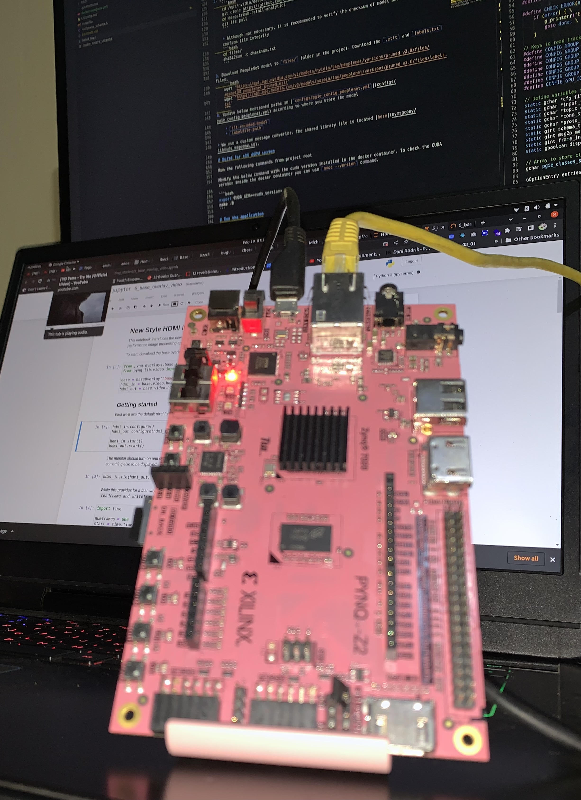

# Nand2Tetris on FPGA 

The repo contains codebase for the Nand2Tetris project using PYNQ-Z2 fpga. 

## Nand2Tetris
- [Offical website](https://www.nand2tetris.org/)
## Basic PYNQ-Z2 Setup 
- [Official PYNQ Setup Guide](https://pynq.readthedocs.io/en/v2.3/getting_started/pynq_z2_setup.html)
- [A PYNQ-Z2 Guide for Absolute Dummies part 1](https://blog.umer-farooq.com/a-pynq-z2-guide-for-absolute-dummies-part-i-fun-with-leds-and-switches-47dd76abf9a9)
- [A PYNQ-Z2 Guide for Absolute Dummies part 2](https://blog.umer-farooq.com/a-pynq-z2-guide-for-absolute-dummies-part-ii-using-verilog-and-vivado-to-burn-code-on-pynq-d856f79948b1)
- [A PYNQ-Z2 Guide for Absolute Dummies part 3](https://blog.umer-farooq.com/a-pynq-z2-guide-for-absolute-dummies-part-iii-tick-tock-using-fpga-clock-33a34ef3f51a)